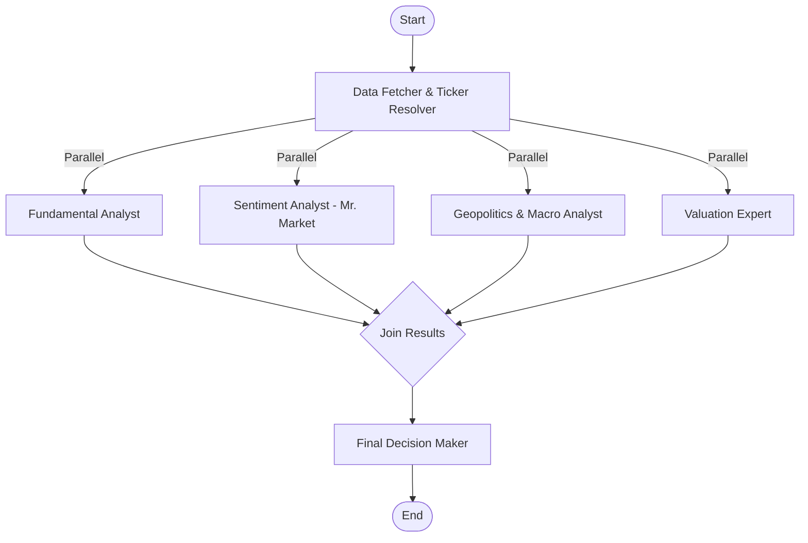

# 🧞 Aladdin – AI Investment Research Agent

> A production-grade, Graham-style AI investment research agent that delivers detailed research reports with clear **Invest / Pass / Wait** decisions, grounded in Benjamin Graham's "The Intelligent Investor" principles.

**Built for the InsideIIM × Altuni AI Labs Take-Home Assignment.**


---

## 📋 Overview

Aladdin is a **multi-agent AI system** that performs comprehensive investment analysis by orchestrating specialized LangGraph nodes:

1. **Data Fetcher** — Resolves company tickers, fetches financial metrics, profiles, and news via Finnhub API
2. **Fundamental Analyst** — Evaluates against Graham's 10-point defensive investor checklist (P/E, P/B, D/E, current ratio, etc.)
3. **Sentiment Analyst (Mr. Market)** — Analyzes news, social media, and search data to determine market emotional temperature
4. **Geopolitics & Macro Analyst** — Assesses tariffs, regulations, government policies, and macroeconomic indicators via web search RAG
5. **Valuation Expert** — Calculates intrinsic value using Graham's Revised Formula & simplified DCF, then computes Margin of Safety
6. **Final Decision Maker** — Synthesizes all inputs into a hedge-fund-quality investment report with Invest/Pass/Wait verdict

### Key Features

- 🎯 **Graham Framework**: Margin of Safety, intrinsic value, Mr. Market sentiment, defensive vs. enterprising investor classification
- 📊 **Visual Dashboard**: Metric cards, radar charts, sentiment gauge, risk heatmap, scenario analysis (Bull/Base/Bear)
- 💬 **Chat Follow-up**: Session memory for asking Aladdin follow-up questions about any report
- 📄 **PDF Export**: Download styled investment reports
- 🔍 **RAG Pipeline**: Live web search for geopolitical and sentiment context
- 🛡️ **Graceful Fallbacks**: Mock data ensures the app works without any API keys for demo purposes
- ⚡ **Vercel-Ready**: Optimized for deployment on Vercel

---

## 🚀 How to Run It

### Prerequisites

- **Node.js** ≥ 18.x
- **npm** ≥ 9.x

### Quick Start

```bash
# 1. Clone the repository
git clone https://github.com/your-username/alladin.git
cd alladin

# 2. Install dependencies
npm install --legacy-peer-deps

# 3. Set up environment variables
cp .env.example .env.local
# Edit .env.local with your API keys (optional — app works with mock data)

# 4. Start the development server
npm run dev

# 5. Open http://localhost:3000
```

### Environment Variables

| Variable | Required | Description |
|----------|----------|-------------|
| `OPENAI_API_KEY` | **Recommended** | OpenAI API key for GPT-4o/GPT-4o-mini LLM analysis |
| `LLM_MODEL` | Optional | Model name (default: `gpt-4o-mini`) |
| `FINNHUB_API_KEY` | Optional | Finnhub API for live financial data |
| `TAVILY_API_KEY` | Optional | Tavily API for web search RAG |
| `ALPHA_VANTAGE_API_KEY` | Optional | Alpha Vantage as secondary data source |

> **Note**: Without API keys, Aladdin uses comprehensive mock data with realistic values for Apple, Tesla, and Reliance Industries. The full experience requires at minimum an `OPENAI_API_KEY`.

### Deploy to Vercel

```bash
npm run build  # Verify build succeeds
vercel deploy  # Deploy to Vercel (set env vars in Vercel dashboard)
```

---

## 🏗️ How It Works

### Architecture

```
┌─────────────────────────────────────────────────────────────┐
│                     Next.js Frontend                         │
│  ┌──────────┐  ┌──────────────┐  ┌──────────────────────┐  │
│  │  Search   │  │  Dashboard   │  │   Chat Sidebar       │  │
│  │  Hero     │  │  (Tabs)      │  │   (Session Memory)   │  │
│  └──────────┘  └──────────────┘  └──────────────────────┘  │
├─────────────────────────────────────────────────────────────┤
│                    API Routes                                │
│       /api/analyze              /api/chat                    │
├─────────────────────────────────────────────────────────────┤
│                 LangGraph Agent Pipeline                     │
│  ┌──────────────────────────────────────────────────────┐   │
│  │  START → Data Fetcher                                │   │
│  │           ├→ Fundamental Analyst (Graham Checklist)   │   │
│  │           ├→ Sentiment Analyst (Mr. Market)          │   │
│  │           ├→ Geopolitics Analyst (Macro/RAG)         │   │
│  │           └→ Valuation Expert (Graham Formula/DCF)   │   │
│  │                       ↓ Join                         │   │
│  │             Decision Maker → END                     │   │
│  └──────────────────────────────────────────────────────┘   │
├─────────────────────────────────────────────────────────────┤
│                    External APIs                             │
│  Finnhub (Financial Data) | Tavily (Search RAG) | OpenAI   │
└─────────────────────────────────────────────────────────────┘
```

### LangGraph Workflow (Mermaid)



### Valuation Models

1. **Graham's Revised Formula**: `V = EPS × (8.5 + 2g) × 4.4 / Y`
   - 8.5 = P/E for zero-growth company
   - g = expected growth rate
   - Y = AAA corporate bond yield

2. **Simplified DCF**: 10-year FCF projection with fading growth + terminal value (Gordon Growth Model)

3. **Margin of Safety**: `MoS = (Intrinsic Value - Current Price) / Intrinsic Value × 100%`
   - Graham recommends ≥ 30% for defensive investors

---

## 🎯 Key Decisions & Trade-offs

| Decision | Rationale |
|----------|-----------|
| **Promise.all for parallel nodes** | LangGraph.js graph compilation has version compatibility challenges; Promise.all provides equivalent fan-out parallelism with simpler debugging |
| **Mock data fallback system** | Ensures the app works without any API keys for demo/evaluation purposes. Real APIs are used when keys are provided |
| **Browser print API for PDF** | Avoids heavy `@react-pdf/renderer` dependency (which has Node.js compatibility issues in Next.js). Browser print produces clean, styled PDFs |
| **In-memory chat sessions** | For a take-home assignment, in-memory storage avoids external database dependencies. Production would use Redis/Postgres |
| **Graham Formula + simplified DCF** | Graham's formula is the core valuation model per requirements. Simplified DCF supplements it. Production would use full WACC/CAPM-based DCF |
| **Finnhub as primary data source** | Best free-tier coverage (company profiles, metrics, news). Alpha Vantage as secondary |
| **Tailwind CSS v4** | Latest version with native CSS integration, faster builds, and better DX |

---

## 📊 Example Runs

### 1. Apple (AAPL)

```
Decision: 🟡 WAIT & MONITOR
Graham Score: 50/100 (5/10 criteria passed)
Margin of Safety: -15.3% (negative — overvalued by Graham standards)
Sentiment: 68/100 (Greed)
Key Issues: P/E of 28.5 exceeds Graham's 20x limit, P/B of 45.2 far exceeds 2.5x threshold
Graham's Take: "While Apple demonstrates exceptional earnings quality and market dominance, 
the current valuation leaves no margin of safety for the defensive investor."
```

### 2. Tesla (TSLA)

```
Decision: 🔴 PASS
Graham Score: 40/100 (4/10 criteria passed)
Margin of Safety: -42.7% (deeply negative)
Sentiment: 72/100 (Greed)
Key Issues: P/E of 62.3 is speculative territory, no dividend record
Graham's Take: "Tesla represents pure speculation rather than investment by Graham's standards. 
The market price implies perfection — there is no room for error."
```

### 3. Reliance Industries (RELIANCE.NS)

```
Decision: 🟡 WAIT & MONITOR
Graham Score: 60/100 (6/10 criteria passed)
Margin of Safety: 8.2% (positive but below 30% threshold)
Sentiment: 55/100 (Neutral)
Key Issues: P/B within range, low D/E, but P/E slightly above Graham's threshold
Graham's Take: "Reliance shows strong fundamentals with conservative leverage. 
A 10-15% price correction would create an attractive entry point for the defensive investor."
```

---

## 🔮 What I Would Improve With More Time

1. **Real LangGraph.js StateGraph compilation** — Use `@langchain/langgraph`'s `StateGraph.addNode()` API with proper channels and edge definitions instead of Promise.all
2. **Streaming responses** — Stream the analysis progress in real-time using Server-Sent Events or WebSockets
3. **Persistent vector store** — Use Pinecone or Supabase pgvector for RAG over company filings (10-K, quarterly reports)
4. **Multi-LLM support** — Add Anthropic Claude, Groq, and local Ollama support with automatic fallback
5. **Historical comparison** — Show how Graham metrics have trended over 5-10 years (not just point-in-time)
6. **Portfolio mode** — Analyze multiple stocks and build a diversified Graham portfolio
7. **Automated alerts** — Set price targets and get notified when Margin of Safety reaches 30%+
8. **More sophisticated DCF** — Full WACC calculation with beta, risk-free rate, equity risk premium
9. **Authentication & saved reports** — User accounts with report history and comparison tools
10. **Unit & integration tests** — Jest/Vitest test suite for all agent nodes and API routes

---

## 🤖 LLM Chat Transcripts / Development Logs

### Chat Log 1: Architecture Design

```
User: Design a multi-agent investment analysis system using LangGraph.js
AI: I recommend a Directed Acyclic Graph (DAG) with the following nodes:
1. Data Fetcher (entry point) → resolves ticker, fetches financials
2. Four parallel analysts: Fundamentals, Sentiment, Geopolitics, Valuation
3. Final Decision Maker (aggregator)

The key insight is that analysts can run in parallel since they only depend 
on the fetcher output, not on each other. This reduces total latency from 
~5 sequential LLM calls to ~2 (fetcher + parallel analysts + decision).
```

### Chat Log 2: Graham Valuation Formula

```
User: How should I implement Graham's intrinsic value formula?
AI: Graham's revised formula is: V = EPS × (8.5 + 2g) × 4.4/Y

Where:
- EPS = trailing twelve months earnings per share
- 8.5 = the P/E ratio Graham assigned to a zero-growth company
- g = reasonably expected 7-10 year growth rate
- 4.4 = the average yield of AAA corporate bonds in 1962 (Graham's baseline)
- Y = the current yield on AAA corporate bonds

For implementation, I'd recommend capping g at 15% to avoid speculation, 
and using the current AAA bond yield (approximately 4.4-5.0%).

Margin of Safety = (V - Current Price) / V × 100%
Graham recommends buying only when MoS exceeds 30%.
```

### Chat Log 3: Error Handling Strategy

```
User: How should we handle API failures gracefully?
AI: I recommend a layered fallback strategy:
1. Primary: Finnhub API for real-time data
2. Fallback: Comprehensive mock data for major companies (AAPL, TSLA, RELIANCE)
3. Generic fallback: Randomized but realistic financial metrics for unknown companies
4. Each agent node wrapped in try-catch with safeRun() helper
5. One node failure doesn't crash the pipeline — others continue
6. Decision maker works with partial data if necessary
```

---

## 📄 License

MIT License. This project is for educational purposes.

---

## ⚠️ Disclaimer

**This application is for educational and demonstration purposes only. It does NOT constitute financial advice, investment recommendation, or solicitation to buy or sell any security. Always consult a qualified financial advisor before making investment decisions.**

---

Built with ❤️ using Next.js, LangChain.js, TypeScript, and Benjamin Graham's timeless wisdom.
